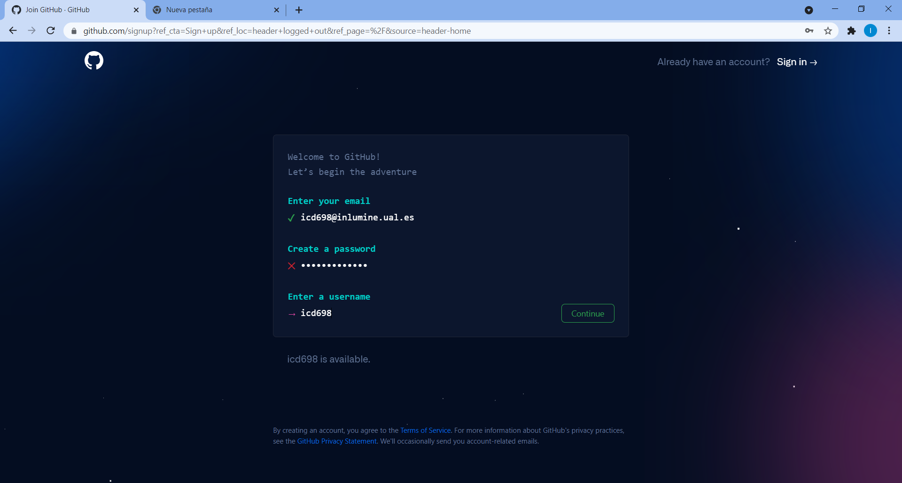

<link rel="stylesheet" type="text/css" href="Inicio/estilo.css" media="screen" />

# Creación de cuenta en github como estudiante de la UAL

Crear la cuenta de github utilizando el boton **Sign up** en la esquina superior derecha de la página ```www.github.com```. Se debe utilizar la cuenta institucional de la universidad de Almería (@inlumine.ual.es) para el registro de la cuenta, indicando que sois estudiantes de la universidad de Almería para poder ser usuarios habilitados.

IMPORTANTE: Se debe utilizar el correo institucional de la universidad (imaguila@inlumine.ual.es) y como nombre de usuario el identificador en el aula virtual seguido de "-ual" (por ejemplo, ```imaguila-ual```, si este estuviese ocupado, añadir "inlumine", al nombre de usuario (```imaguila-ualinlumine```).

Debemos asegurarnos de marcar las opciones de estudiante para poder acogernos a las licencias gratuitas que ofrece github, sino no prodremos trabajar.


## Entrar en www.github.com e incluir el correo de la ual
 Se debe utilizar el correo institucional de la universidad (imaguila@inlumine.ual.es). Cuidado esa cuenta no debe estar dada de alta previamente


## Dar una contraseña


## Seleccionar un nombre de usuario
Como nombre de usuario el identificador en el aula 
virtual (por ejemplo, imaguila, si este 
estuviese ocupado, añadir "inlumine", al nombre de usuario (imaguilainlumine).





## Pulsar continuar después de aceptar o no la publicidad


## Validar que no es boot
Seguir las indicaciones, pide dos veces que se selecciona la galaxia en espiral


## Validación a través del codigo del correo
Se pide un código de validación que se manda al correo del usuario que se esta registrando. Una vez copiado el código numérico se valida automáticamente


## Configurar la cuenta

Lo mas importante aquí es indicar que se es estudiante y poner mas de 50 colaboradores. Además en la segunda pantalla indicar que se va a desarrollar trabajo compartido de codificación


## Apply for your GitHub student benefits

Aquí es donde se tendrá que validar la pertenencia a la ual, que se puede hacer con foto de carnet de estudiante o un pantallazo de los datos personales desde el campus virtual

- Pulsamos botón azul


-Pulsamos botón verde "sing up"


-Pulsamos azul "Get student benefits"


- Rellenar el campo de para que se utilizará la cuenta, por ejemplo incluyendo "asignatura programación" y continuar


- Subir una prueba de estudiante (carnet o pantallazo)


- Ya ha finalizado la inscripción 


## Completar el perfil con el nombre completo y una foto si se desea

Entar el "profile" del usuario e incluir el nombre completo y una foto o imagen descriptiva 


